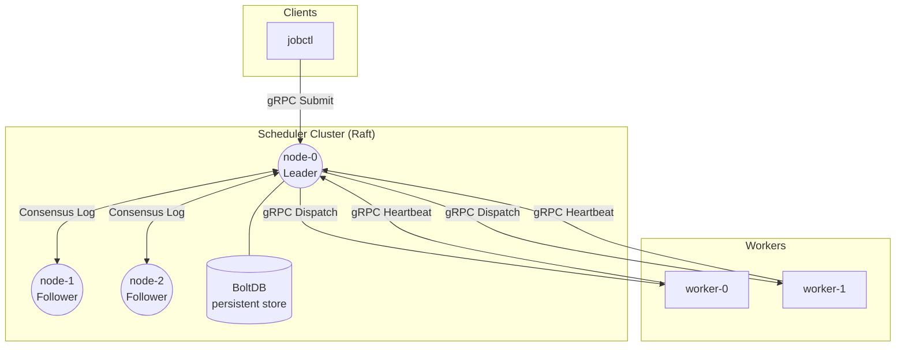

# Distributed Job Scheduler (Raft + gRPC)

A distributed, resource-aware job scheduler written in Go. The system uses **HashiCorp Raft** for replicated consensus across the scheduler cluster (maintaining job and worker metadata in **BoltDB**), and **gRPC** for scheduling orchestration and task dispatch.

---

## System Components

The project is split into three main components:

1. **Scheduler (`cmd/scheduler`)**:
   - Implements a Raft node to form a replicated state machine.
   - Only the active Raft leader schedules jobs and listens to worker heartbeats.
   - Maintains an in-memory priority queue of tasks and routes them using resource-aware placement strategies.
   - State is persisted locally using BoltDB (via `go.etcd.io/bbolt`).
2. **Worker (`cmd/worker`)**:
   - Lightweight daemon running on execution nodes.
   - Auto-detects local resources (CPUs and memory) and registers them with the scheduler leader.
   - Exposes a gRPC service for the scheduler to dispatch commands.
   - Regularly sends heartbeats containing the list of currently running task IDs and remaining resource capacity.
3. **Job Controller (`cmd/jobctl`)**:
   - Command-line client for interacting with the scheduler cluster.
   - Supports job submission (single task or dependency graphs/DAGs), status checks, termination, and node monitoring.

---

## Architecture Flow



---

## Tech Stack

- **Language**: Go 1.23 / 1.26
- **Communication**: gRPC / Protocol Buffers
- **Consensus**: `github.com/hashicorp/raft` (with `raft-boltdb/v2`)
- **Storage**: `go.etcd.io/bbolt` (Embedded key/value database)
- **Containerization**: Docker & Docker Compose (Alpine runtime stage)

---

## Core Features

### Resource-Aware Scheduling
When scheduling a task, the leader scores candidate worker nodes based on their available CPU, memory, GPU, and disk. The system currently supports:
* **Best Fit (Default)**: Assigns tasks to the worker where they take up the largest proportion of remaining resources (packing tasks tightly and leaving other nodes clear for larger requirements).
* **Spread**: Distributes load evenly across the cluster by targeting nodes with the most remaining resources.

### Dependency Graph (DAG) Support
Job graphs can be submitted where tasks depend on other tasks:
* **Validation**: Checks for cycles and invalid dependencies on submission using a 3-color DFS marking algorithm.
* **Execution**: Computes execution order using Kahn's topological sort. Downstream tasks are queued incrementally only as their upstream dependencies transition to `COMPLETED`. If a task fails, downstream dependents are marked as `CANCELLED` automatically.

### Fault Tolerance & Retries
* **Task Retries**: Tasks can configure custom retry policies with exponential backoff and randomized jitter to prevent thundering herd issues.
* **Worker Health Checks**: The scheduler monitors heartbeats. If a worker fails to heartbeat for 30 seconds, it is marked dead, and any active tasks that were running on it are automatically rescheduled on other healthy workers.
* **Consensus Failover**: If the Raft leader dies, the remaining nodes hold an election. The new leader automatically takes over the scheduler queue and heartbeat monitoring.

---

## Quick Start (Running Locally)

### 1. Build Binaries
Build the compiled executables for the scheduler, worker, and CLI client:
```bash
go build -o bin/scheduler cmd/scheduler/main.go
go build -o bin/worker cmd/worker/main.go
go build -o bin/jobctl cmd/jobctl/main.go
```
*(On Windows, `go build` will automatically append the `.exe` extension to the output paths).*

### 2. Start a 3-Node Scheduler Cluster
Run each command in a separate terminal:

* **Node 0 (Bootstrap Leader)**:
  ```bash
  ./bin/scheduler --bootstrap --id node-0 --raft-addr 127.0.0.1:7000 --grpc-addr 127.0.0.1:8000
  ```

* **Node 1 (Join Cluster)**:
  ```bash
  ./bin/scheduler --id node-1 --raft-addr 127.0.0.1:7001 --grpc-addr 127.0.0.1:8001 --join 127.0.0.1:8000
  ```

* **Node 2 (Join Cluster)**:
  ```bash
  ./bin/scheduler --id node-2 --raft-addr 127.0.0.1:7002 --grpc-addr 127.0.0.1:8002 --join 127.0.0.1:8000
  ```

### 3. Start a Worker
The worker registers with the scheduler leader (port `8000`):
```bash
./bin/worker --id worker-0 --scheduler 127.0.0.1:8000 --grpc-addr 127.0.0.1:9000
```

### 4. Submit and Track Jobs
Use the `jobctl` binary to submit tasks:
```bash
# Submit a single job
./bin/jobctl submit --name "my-task" --cmd "echo hello world"

# List jobs
./bin/jobctl list

# Inspect a job's task state and logs
./bin/jobctl status --job-id <JOB_ID>

# List registered workers and resource utilization
./bin/jobctl workers
```

---

## Running with Docker (Recommended)

A local environment can be spun up using Docker Compose:

```bash
# Build the images and start the containers in the foreground
docker compose up --build

# Stop the containers (keeps databases and state logs intact)
docker compose down

# Stop and wipe the cluster state (removes databases and Raft history)
docker compose down -v
```

To interact with the Docker cluster, the host CLI binary can be used:
```bash
./bin/jobctl submit --name "docker-job" --cmd "echo Hello from Docker"
```
Or run the CLI directly inside the running scheduler container:
```bash
docker exec -it scheduler-0 ./jobctl list
```

---

## Benchmarks

I designed the core scheduling algorithms for zero-allocation (`0 allocs/op`) in the hot path. The benchmark suite can be executed using:
```bash
go test -run=^$ -bench=Benchmark -benchmem -count=1 ./pkg/...
```

**Key Performance Metrics (Intel i5-13420H):**
- **Placement Engine**: I built the engine to score and select from 500 workers in `< 1µs` (0 heap allocations).
- **DAG Resolution**: Kahn's topological sort validates and sorts a 1,000-task dependency graph in exact `253,911 ns/op` (`~254µs`).
- **Priority Queue**: High-contention concurrent enqueue/dequeue operations resolve in exact `175.5 ns/op`.

<details>
<summary><b>Click to view raw benchmark data</b></summary>

### Models Package (`pkg/models`)
This benchmark tests my core model structures, specifically ensuring that evaluating multidimensional resource constraints (CPU, memory, GPUs, etc.) is extremely fast.
```text
BenchmarkResourceFits-12            	1000000000	         0.1182 ns/op	       0 B/op	       0 allocs/op
BenchmarkResourceAllocate-12        	154812061	         7.776 ns/op	       0 B/op	       0 allocs/op
BenchmarkResourceRelease-12         	120841636	         9.938 ns/op	       0 B/op	       0 allocs/op
BenchmarkAllocateReleaseCycle-12    	31664106	        36.84 ns/op	       0 B/op	       0 allocs/op
BenchmarkUtilizationPercent-12      	372620121	         2.802 ns/op	       0 B/op	       0 allocs/op
BenchmarkJobValidation/tasks-1-12   	932377024	         1.292 ns/op	       0 B/op	       0 allocs/op
BenchmarkJobValidation/tasks-10-12  	387339172	         3.142 ns/op	       0 B/op	       0 allocs/op
BenchmarkJobValidation/tasks-100-12 	36017215	        43.60 ns/op	       0 B/op	       0 allocs/op
BenchmarkTaskByID/tasks-10-12       	27024835	        42.25 ns/op	       0 B/op	       0 allocs/op
BenchmarkTaskByID/tasks-100-12      	 3013560	       388.2 ns/op	       0 B/op	       0 allocs/op
BenchmarkTaskByID/tasks-500-12      	  644644	      1860 ns/op	       0 B/op	       0 allocs/op
BenchmarkAllTasksTerminal/tasks-10-12         	440659636	         2.681 ns/op	       0 B/op	       0 allocs/op
BenchmarkAllTasksTerminal/tasks-100-12        	33207328	        30.17 ns/op	       0 B/op	       0 allocs/op
BenchmarkAllTasksTerminal/tasks-500-12        	 6879640	       178.0 ns/op	       0 B/op	       0 allocs/op
```

### Scheduler Package (`pkg/scheduler`)
This package is the heart of my system. The `ValidateDAG` benchmark is the 3-color DFS cycle detection, and `TopologicalSort` is my implementation of Kahn's algorithm. `SelectWorker` shows how fast I can run resource placement against hundreds of workers.
```text
BenchmarkValidateDAG/chain-50-12        	  101929	     11366 ns/op	   12104 B/op	      70 allocs/op
BenchmarkValidateDAG/chain-200-12       	   26412	     46346 ns/op	   50920 B/op	     232 allocs/op
BenchmarkValidateDAG/fan-out-50-12      	  127724	      9436 ns/op	    8576 B/op	      21 allocs/op
BenchmarkValidateDAG/fan-out-200-12     	   33246	     36974 ns/op	   35840 B/op	      31 allocs/op
BenchmarkValidateDAG/diamond-50-12      	  108128	     10755 ns/op	   10008 B/op	      50 allocs/op
BenchmarkTopologicalSort/chain-50-12    	  139166	      8818 ns/op	   11776 B/op	     116 allocs/op
BenchmarkTopologicalSort/chain-200-12   	   33324	     35980 ns/op	   50112 B/op	     426 allocs/op
BenchmarkTopologicalSort/chain-1000-12  	    4690	    253911 ns/op	  366434 B/op	    2046 allocs/op
BenchmarkTopologicalSort/fan-out-50-12  	  174220	      7085 ns/op	    9624 B/op	      25 allocs/op
BenchmarkTopologicalSort/fan-out-200-12 	   46161	     29207 ns/op	   41176 B/op	      35 allocs/op
BenchmarkGetReadyTasks/chain-50-12      	 1000000	      1140 ns/op	      16 B/op	       1 allocs/op
BenchmarkGetReadyTasks/chain-200-12     	  273230	      4401 ns/op	      16 B/op	       1 allocs/op
BenchmarkGetReadyTasks/fan-out-50-12    	 1000000	      1150 ns/op	      16 B/op	       1 allocs/op
BenchmarkGetReadyTasks/fan-out-200-12   	  247255	      4415 ns/op	      16 B/op	       1 allocs/op
BenchmarkPropagateFailure/chain-50-12   	   68305	     23398 ns/op	   23160 B/op	     140 allocs/op
BenchmarkPropagateFailure/chain-200-12  	   12504	     90271 ns/op	   97912 B/op	     462 allocs/op
BenchmarkPropagateFailure/fan-out-50-12 	   64768	     18571 ns/op	   19632 B/op	      91 allocs/op
BenchmarkDAGExecutorWalkthrough-12      	    6252	    184353 ns/op	   38784 B/op	     334 allocs/op
BenchmarkScoreWorkerBestFit-12          	405935040	         2.957 ns/op	       0 B/op	       0 allocs/op
BenchmarkScoreWorkerSpread-12           	376208569	         3.331 ns/op	       0 B/op	       0 allocs/op
BenchmarkSelectWorker/workers-5/bestfit-12         	51525585	        25.12 ns/op	       0 B/op	       0 allocs/op
BenchmarkSelectWorker/workers-5/spread-12          	17190670	        61.25 ns/op	       0 B/op	       0 allocs/op
BenchmarkSelectWorker/workers-20/bestfit-12        	 4785757	       266.4 ns/op	       0 B/op	       0 allocs/op
BenchmarkSelectWorker/workers-20/spread-12         	 4819744	       252.5 ns/op	       0 B/op	       0 allocs/op
BenchmarkSelectWorker/workers-100/bestfit-12       	 2064591	       579.2 ns/op	       0 B/op	       0 allocs/op
BenchmarkSelectWorker/workers-100/spread-12        	 5098124	       234.8 ns/op	       0 B/op	       0 allocs/op
BenchmarkSelectWorker/workers-500/bestfit-12       	 1329783	       909.3 ns/op	       0 B/op	       0 allocs/op
BenchmarkSelectWorker/workers-500/spread-12        	 1332187	       891.1 ns/op	       0 B/op	       0 allocs/op
BenchmarkEstimateClusterCapacity/workers-10-12     	527059682	         2.297 ns/op	       0 B/op	       0 allocs/op
BenchmarkEstimateClusterCapacity/workers-100-12    	43522255	        27.94 ns/op	       0 B/op	       0 allocs/op
BenchmarkEstimateClusterCapacity/workers-1000-12   	 3458468	       345.2 ns/op	       0 B/op	       0 allocs/op
BenchmarkCanFitAnywhere/workers-10/fits-12         	1000000000	         0.8485 ns/op	       0 B/op	       0 allocs/op
BenchmarkCanFitAnywhere/workers-10/no-fit-12       	320123865	         3.704 ns/op	       0 B/op	       0 allocs/op
BenchmarkCanFitAnywhere/workers-100/fits-12        	1000000000	         0.8491 ns/op	       0 B/op	       0 allocs/op
BenchmarkCanFitAnywhere/workers-100/no-fit-12      	26939956	        44.61 ns/op	       0 B/op	       0 allocs/op
BenchmarkCanFitAnywhere/workers-1000/fits-12       	1000000000	         0.8577 ns/op	       0 B/op	       0 allocs/op
BenchmarkCanFitAnywhere/workers-1000/no-fit-12     	 1962567	       606.2 ns/op	       0 B/op	       0 allocs/op
BenchmarkEnqueue-12                                	 6444585	       174.9 ns/op	     145 B/op	       2 allocs/op
BenchmarkDequeue-12                                	 2418176	       585.1 ns/op	       0 B/op	       0 allocs/op
BenchmarkEnqueueDequeue-12                         	 9960985	       126.0 ns/op	     104 B/op	       3 allocs/op
BenchmarkPeek-12                                   	100000000	        11.71 ns/op	       0 B/op	       0 allocs/op
BenchmarkDrainCycle/size-100-12                    	   84954	     15257 ns/op	   11903 B/op	     210 allocs/op
BenchmarkDrainCycle/size-1000-12                   	    5859	    219299 ns/op	  119775 B/op	    2757 allocs/op
BenchmarkRemoveCycle/size-100-12                   	  111654	     11954 ns/op	   11014 B/op	     210 allocs/op
BenchmarkRemoveCycle/size-1000-12                  	   10000	    124043 ns/op	  111596 B/op	    2758 allocs/op
BenchmarkConcurrentEnqueueDequeue-12               	 7038775	       175.5 ns/op	      52 B/op	       1 allocs/op
BenchmarkHighContentionEnqueue-12                  	 4885521	       239.8 ns/op	     148 B/op	       3 allocs/op
```

### Store Package (`pkg/store`)
This tests the underlying BoltDB storage speed.
```text
BenchmarkSaveJob/tasks-1-12         	    2076	    594608 ns/op	   34424 B/op	     156 allocs/op
BenchmarkSaveJob/tasks-10-12        	    1852	    641322 ns/op	   83872 B/op	     313 allocs/op
BenchmarkSaveJob/tasks-50-12        	    1504	    821930 ns/op	  209178 B/op	     909 allocs/op
BenchmarkGetJob-12                  	   39183	     30487 ns/op	    4769 B/op	      92 allocs/op
BenchmarkListJobs/jobs-10-12        	    6853	    164567 ns/op	   24722 B/op	     512 allocs/op
BenchmarkListJobs/jobs-100-12       	     732	   1632256 ns/op	  246261 B/op	    5015 allocs/op
BenchmarkListJobs/jobs-500-12       	     142	   8124804 ns/op	 1235547 B/op	   25465 allocs/op
BenchmarkGetTask-12                 	  346971	      3504 ns/op	    1112 B/op	      21 allocs/op
BenchmarkUpdateTask-12              	    2832	    461434 ns/op	    7577 B/op	      44 allocs/op
BenchmarkSaveWorker-12              	    2324	    481692 ns/op	   18727 B/op	      70 allocs/op
BenchmarkListWorkers/workers-10-12  	   39307	     29754 ns/op	    6121 B/op	     122 allocs/op
BenchmarkListWorkers/workers-100-12 	    3813	    295892 ns/op	   57066 B/op	    1116 allocs/op
BenchmarkListWorkers/workers-500-12 	     818	   1467701 ns/op	  281900 B/op	    5518 allocs/op
BenchmarkDeleteJob-12               	     668	   1558784 ns/op	   24766 B/op	     240 allocs/op
BenchmarkSaveDAG-12                 	    1971	    577748 ns/op	   75899 B/op	     258 allocs/op
```

### Retry Package (`pkg/retry`)
Tests my exponential backoff and jitter implementation.
```text
BenchmarkComputeBackoff-12             	94423504	        12.66 ns/op	       0 B/op	       0 allocs/op
BenchmarkComputeBackoffMaxCapped-12    	68222906	        17.45 ns/op	       0 B/op	       0 allocs/op
BenchmarkIsTransient/transient-12      	23665604	        50.02 ns/op	       8 B/op	       1 allocs/op
BenchmarkIsTransient/plain-12          	23975305	        51.36 ns/op	       8 B/op	       1 allocs/op
BenchmarkIsPermanent/permanent-12      	24697048	        50.54 ns/op	       8 B/op	       1 allocs/op
BenchmarkIsPermanent/plain-12          	23475922	        50.96 ns/op	       8 B/op	       1 allocs/op
BenchmarkDoImmediateSuccess-12         	551952024	         2.329 ns/op	       0 B/op	       0 allocs/op
BenchmarkDoPermanentFailure-12         	22600316	        51.73 ns/op	       8 B/op	       1 allocs/op
BenchmarkDoRetryThenSucceed-12         	    2907	    372305 ns/op	     512 B/op	       8 allocs/op
```

### Worker Package (`pkg/worker`)
Tests the memory-constrained execution wrapper to ensure logs don't exceed allocations.
```text
BenchmarkLimitedWriter/under-limit-12   	 3429014	       361.2 ns/op	    2048 B/op	       1 allocs/op
BenchmarkLimitedWriter/at-limit-12      	 5797969	       219.0 ns/op	     512 B/op	       1 allocs/op
BenchmarkLimitedWriter/over-limit-discard-12         	 1000000	      1156 ns/op	      64 B/op	       1 allocs/op
BenchmarkLimitedWriterSmallChunks/1byte-writes-12    	1000000000	         1.010 ns/op	       0 B/op	       0 allocs/op
```
</details>
